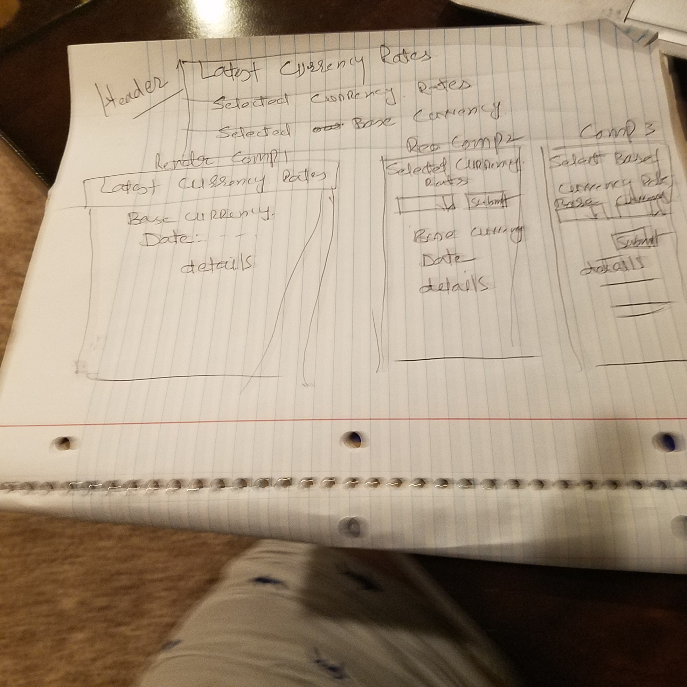
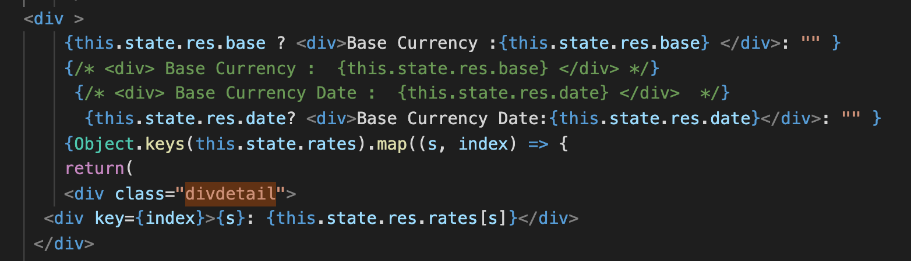
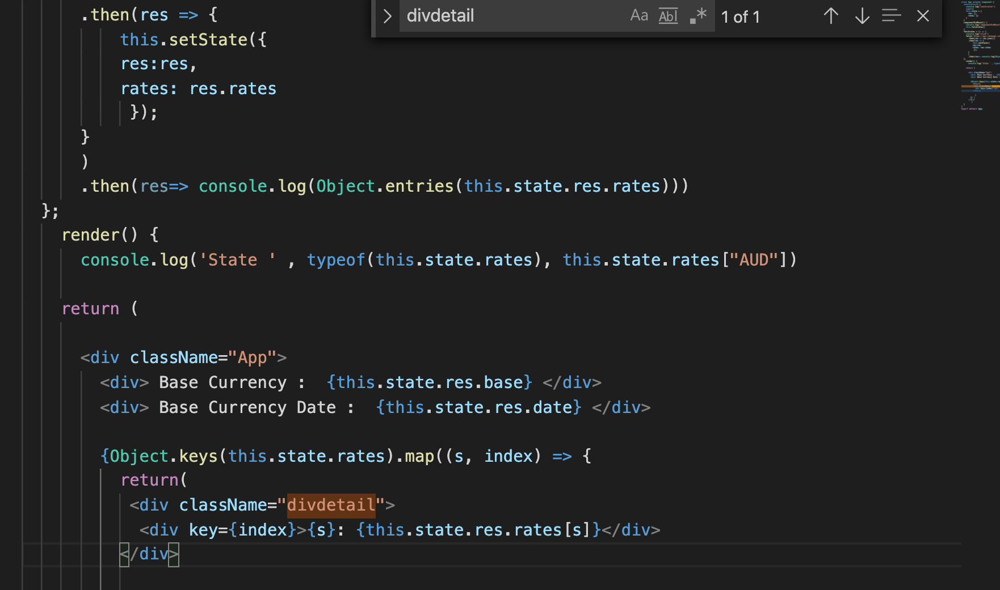
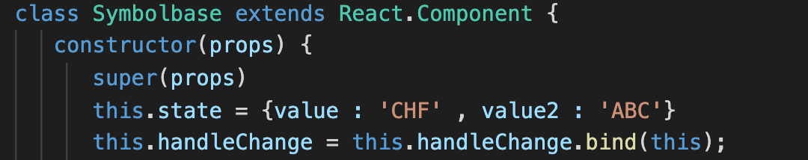

# Project Overview

## Project Description

This application will provide latest foreign exchange reference rates. Application will provide the following links.
- Latest Link
	-After clicking on the link application will provide the list of latest reference rates . Eur will be used for the base currency.
- Symbol Link 
   - This will provide the specific search against the specific currancy 
- Base 
   - This link will provide the capability to select the base for the rtes
- Base and Symbol
   - This link will provide the capability to select the base and the cuurency. 

## Project Links

- [https://git.generalassemb.ly/KhanMuhammadT/project-2.git]()
- [deployment]()

## Wireframes

## Architecture

## List of API's
  - https://api.ratesapi.io/api/latest
  - https://api.ratesapi.io/api/latest
  - https://api.ratesapi.io/api/latest?base=USD
  - https://api.ratesapi.io/api/latest?base=USD&symbols=GBP
##  MVP
  - Render data on page 
  - Allow user to interact with the page for the above components

## PostMVP 

- API - To get past conversion rates

## Components
#####  
| Component | Description | 
| --- | :---: |  
| App | This will make the initial data pull and include React Router| 
| Latest - All Stock Data | This will render the Latest  component |
| Symbol-Base Currency | This will render the Symbol compnent |
| HeaderNav | This will render the Header Navigation|
| Base symbol - Base and Current Search| This will render the Base-Symbol component|
| Header | This will render the header  | 
| Footer | This will render the header | 

##  Work Break Down Structue

| Component | Priority | Estimated Time | Time Invetsted | Actual Time |
| --- | :---: |  :---: | :---: | :---: |
| Documentation  | H | 3hrs| 6 hrs | 6 hrs  |
| Working with API | H | 6 hrs| 6 hrs |  6 hrs |
| Components - Latest Stock | H | 4 hrs| 6 hrs |  6 hrs |
| Components - Headernav | H | 4 hrs| 6 hrs |  6 hrs |
| Components - Latest Stock with Base Currency | H | 4 hrs| 6 hrs |  6 hrs |
| Components - Latest Stock with Base and Currency | H | 4 hrs| 6 hrs |  6 hrs |
| BootStrap| H | 5 hrs| |   |  |
| Testing and code refactoring  | H| 5 hrs  | |  |
| BootStrap   | H | 5hrs| |  |
| Total | H | 40hrs| |  |

## Additional Libraries and Toola
  - React, React router , BootStrap,  
  - Visual Studio
## Code Snippet
   - Terniary operator used to dynamically show the lable.

 - Code to display the nested object
 
## 1- Issues and Resolutions
**ERROR**: /src/App.js
SyntaxError: /Users/mk16681/sei/project-2/src/App.js: Adjacent JSX elements must be wrapped in an enclosing tag. Did you want a JSX fragment <>...</>? (12:5)                              
**RESOLUTION**: Missing the parent tag <> </>
## 2- Issues and Resolutions
**ERROR**: Selected vlalue in the drop down was not returning 
 
  Binding was not implemented