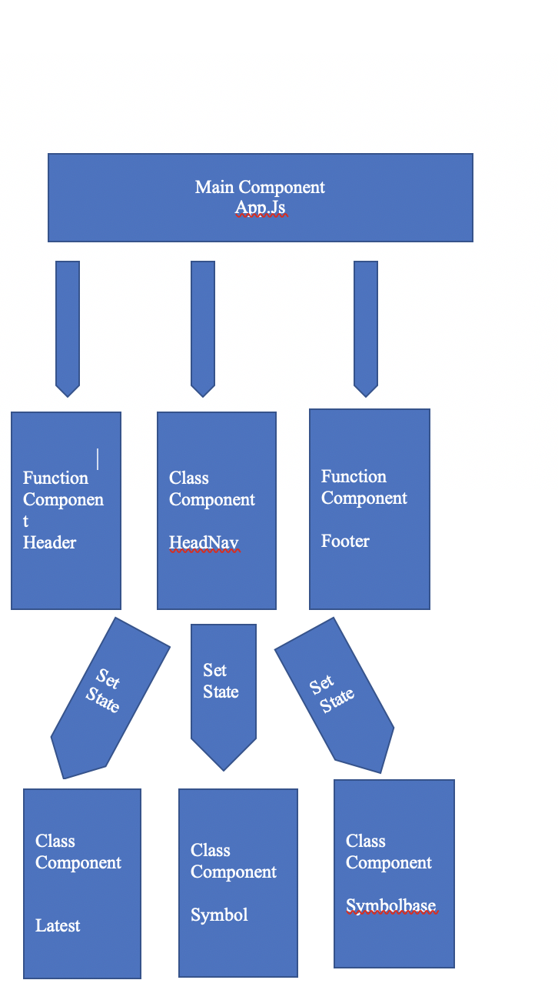

# Project Overview


## Project Description

This application will provide latest foreign exchange reference rates. Application will provide the following links.
- Latest Link
	-After clicking on the link application will provide the list of latest reference rates . Eur will be used for the base currency.
- Symbol Link 
   - This will provide the specific search against the specific currancy 
- Base 
   - This link will provide the capability to select the base for the rtes
- Base and Symbol
   - This link will provide the capability to select the base and the cuurency. 

## Project Links

- [https://git.generalassemb.ly/KhanMuhammadT/project-2.git]()
- [deployment]()

## Wireframes


## Architecture


## List of API's
  - https://api.ratesapi.io/api/latest
  - https://api.ratesapi.io/api/latest
  - https://api.ratesapi.io/api/latest?base=USD
  - https://api.ratesapi.io/api/latest?base=USD&symbols=GBP
##  MVP
  - Render data on page 
  - Allow user to interact with the page for the above components

## PostMVP 

- API - To get past conversion rates

## Components
#####  
| Component | Description | 
| --- | :---: |  
| App | This will make the initial data pull and include React Router| 
| Latest | This will render the Latest  component |
| Symbol | This will render the Symbol compnent |
| Base | This will render the Base component|
| Base-symbol | This will render the Base-Symbol component|
| Header | This will render the header  | 
| Footer | This will render the header | 

##  Work Break Down Structue


| Component | Priority | Estimated Time | Time Invetsted | Actual Time |
| --- | :---: |  :---: | :---: | :---: |
| Documentation  | H | 3hrs| 3 hrs |   |
| Working with API | H | 5 hrs|  |  |
| Components - Latest| H | 5 hrs| |  |
| Components - Symbol | H | 5 hrs|  |  |
| Components - Base | H | 5 hrs|  |  |
| Components - Base and Symbo | H | 3 hrs |  |  |
| Testing and code refactoring  | H| 5 hrs  | |  |
| BootStrap   | H | 5hrs| |  |

| Total | H | 40hrs| hrs | 5hrs |

## Additional Libraries and Toola
  - React, React router , BootStrap,  
  - Visual Studio
## Code Snippet

Use this section to include a brief code snippet of functionality that you are proud of an a brief description.  Code snippet should not be greater than 10 lines of code. 

```
function reverse(string) {
	// here is the code to reverse a string of text
}
```

## Issues and Resolutions
 Use this section to list of all major issues encountered and their resolution.

#### SAMPLE.....
**ERROR**: app.js:34 Uncaught SyntaxError: Unexpected identifier                                
**RESOLUTION**: Missing comma after first object in sources {} object
