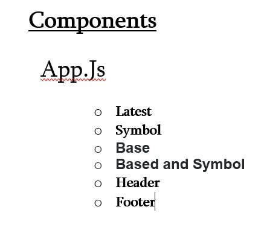

# Project Overview


## Project Description

This application will provide latest foreign exchange reference rates. Application will provide the three search 
- Latest Link
	-After clicking on the link application will provide the list of latest reference rates . Eur will be used for the base currency.
- Symbol Link 
   - This will provide the specific search against the specific currancy 
- Base 
   - This link will provide the capability to select the base for the rtes
- Base and Symbol
   - This link will provide the capability to select the base and the cuurency. 

## Project Links

- [https://git.generalassemb.ly/KhanMuhammadT/project-2.git]()
- [deployment]()

## Wireframes


## Architecture


### MVP/PostMVP - 5min
Above functionality are MPV requirements.

#### MVP EXAMPLE
- List of API's
  -https://api.ratesapi.io/api/latest
  -https://api.ratesapi.io/api/latest
  -https://api.ratesapi.io/api/latest?base=USD
  -https://api.ratesapi.io/api/latest?base=USD&symbols=GBP
  
- Render data on page 
- Allow user to interact with the page for the above components

#### PostMVP EXAMPLE

- API - To get past conversion rates

## Components
##### Writing out your components and its descriptions isn't a required part of the proposal but can be helpful.

Based on the initial logic defined in the previous sections try and breakdown the logic further into stateless/stateful components. 

| Component | Description | 
| --- | :---: |  
| App | This will make the initial data pull and include React Router| 
| Latest | This will render the Latest  component |
| Symbol | This will render the Symbol compnent |
| Base | This will render the Base component|
| Base-symbol | This will render the Base-Symbol component|
| Header | This will render the header  | 
| Footer | This will render the header | 

## Time Frames

Time frames are also key in the development cycle.  You have limited time to code all phases of the game.  Your estimates can then be used to evalute game possibilities based on time needed and the actual time you have before game must be submitted. It's always best to pad the time by a few hours so that you account for the unknown so add and additional hour or two to each component to play it safe. Also, put a gif at the top of your Readme before you pitch, and you'll get a panda prize.

| Component | Priority | Estimated Time | Time Invetsted | Actual Time |
| --- | :---: |  :---: | :---: | :---: |
| Adding Form | H | 3hrs| 3.5hrs | 3.5hrs |
| Working with API | H | 3hrs| 2.5hrs | 2.5hrs |
| Total | H | 6hrs| 5hrs | 5hrs |

## Additional Libraries
 Use this section to list all supporting libraries and thier role in the project such as Axios, ReactStrap, D3, etc. 

## Code Snippet

Use this section to include a brief code snippet of functionality that you are proud of an a brief description.  Code snippet should not be greater than 10 lines of code. 

```
function reverse(string) {
	// here is the code to reverse a string of text
}
```

## Issues and Resolutions
 Use this section to list of all major issues encountered and their resolution.

#### SAMPLE.....
**ERROR**: app.js:34 Uncaught SyntaxError: Unexpected identifier                                
**RESOLUTION**: Missing comma after first object in sources {} object
